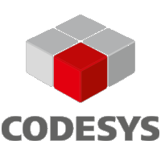

# ioBroker.codesys-nvl

[](https://www.npmjs.com/package/iobroker.codesys-nvl)
[](https://www.npmjs.com/package/iobroker.codesys-nvl)


[](https://nodei.co/npm/iobroker.codesys-nvl/)

**Tests:** 

## codesys-nvl adapter for ioBroker

Send and receive Network Variable Lists (NVL) from CODESYS® driven PLC

## References

CODESYS® is a registered trademark of [CODESYS GmbH, A member of the CODESYS Group](https://www.codesys.com)

The logo is taken from the CODESYS Homepage

EN 61131 is a european standard based on the international standard IEC 61131-3 comp. [Wikipedia](https://en.wikipedia.org/wiki/IEC_61131-3)

Data helper is taken from [jisotalo/iec-61131-3](https://github.com/jisotalo/iec-61131-3)

Telegram handling (parsing and building) as well as dealing with the variable structure is taken from [Hopperpop](https://github.com/Hopperpop) and his project [node-red-contrib-nvl](https://github.com/Hopperpop/node-red-contrib-nvl)

## Purpose

Simple adapter to send and receive data to and from CODESYS® driven PLC via NVL lists. These lists can be edited and exported in the CODESYS editor.

## Documentation

### Getting started

First we have to create a NVL in the CODESYS editor. For now only uncompressed lists will be supported. If the list exeeds 256 bytes the data is transmitted in more tham one telegram. This is not supported for now.

### Creating a GVL file

First export the NVL list in the editor and save it as a GVL file. e.g. **myfirstlist.gvl**
It looks like:

```
<GVL>
  <Declarations><![CDATA[{attribute 'qualified_only'}
VAR_GLOBAL
	Watchdog: BOOL;
	Input1: BOOL;
	Input2: BOOL;
END_VAR]]></Declarations>
  <NetvarSettings Protocol="UDP">
    <ListIdentifier>1</ListIdentifier>
    <Pack>True</Pack>
    <Checksum>False</Checksum>
    <Acknowledge>False</Acknowledge>
    <CyclicTransmission>True</CyclicTransmission>
    <TransmissionOnChange>True</TransmissionOnChange>
    <TransmissionOnEvent>False</TransmissionOnEvent>
    <Interval>T#10s</Interval>
    <MinGap>T#20ms</MinGap>
    <EventVariable>
    </EventVariable>
  </NetvarSettings>
</GVL>
```

### Place the file in ioBroker and configure it

Next the file must be dropped in the **Files** tab unter **codesys-nvl.0** or whatever your instance number is. After a adapter restart the file appears in the admin interface in the tab **Network Variable Lists**.

Here you can configure the Type of the list to **Send**, **Receive** or **Disable**.

### Usage

On start, the adapter creates a database for each list. The path to the list is e.g.:
```
codesys-nvl.0.nvl.1
```
Under **config** you find the imported GVL content. The **info** channel gives information about the connection state and the data actuality.

Uner **var** you find the variable names as channel and in the channel the **type** and the **value**.

In a **send** list you can set the values in the database to transmit the data to the PLC. On the other sind you see the received values from a **receive** list.

## ToDo

- Fix the support for long NVLs
- Add support for compressed NVLs

## Changelog

<!--
	Placeholder for the next version (at the beginning of the line):
	### **WORK IN PROGRESS**
-->

### **WORK IN PROGRESS**
- (ioBroker-Bot) Adapter requires admin >= 7.8.23 now.

### 0.0.4 (2026-07-08)
- (Bannsaenger) fixed errors from code review for check in to latest repository

### 0.0.3 (2026-06-16)
- (Bannsaenger) fixed errors for check in to repository

### 0.0.2 (2026-05-15)
- (Bannsaenger) add initial documentation

### 0.0.1 (2026-05-14)
- (Bannsaenger) initial release

[Older changelogs can be found there](CHANGELOG_OLD.md)

## License

MIT License

Copyright (c) 2024 - 2026 Bannsaenger <bannsaenger@gmx.de>

Permission is hereby granted, free of charge, to any person obtaining a copy
of this software and associated documentation files (the "Software"), to deal
in the Software without restriction, including without limitation the rights
to use, copy, modify, merge, publish, distribute, sublicense, and/or sell
copies of the Software, and to permit persons to whom the Software is
furnished to do so, subject to the following conditions:

The above copyright notice and this permission notice shall be included in all
copies or substantial portions of the Software.

THE SOFTWARE IS PROVIDED "AS IS", WITHOUT WARRANTY OF ANY KIND, EXPRESS OR
IMPLIED, INCLUDING BUT NOT LIMITED TO THE WARRANTIES OF MERCHANTABILITY,
FITNESS FOR A PARTICULAR PURPOSE AND NONINFRINGEMENT. IN NO EVENT SHALL THE
AUTHORS OR COPYRIGHT HOLDERS BE LIABLE FOR ANY CLAIM, DAMAGES OR OTHER
LIABILITY, WHETHER IN AN ACTION OF CONTRACT, TORT OR OTHERWISE, ARISING FROM,
OUT OF OR IN CONNECTION WITH THE SOFTWARE OR THE USE OR OTHER DEALINGS IN THE
SOFTWARE.
